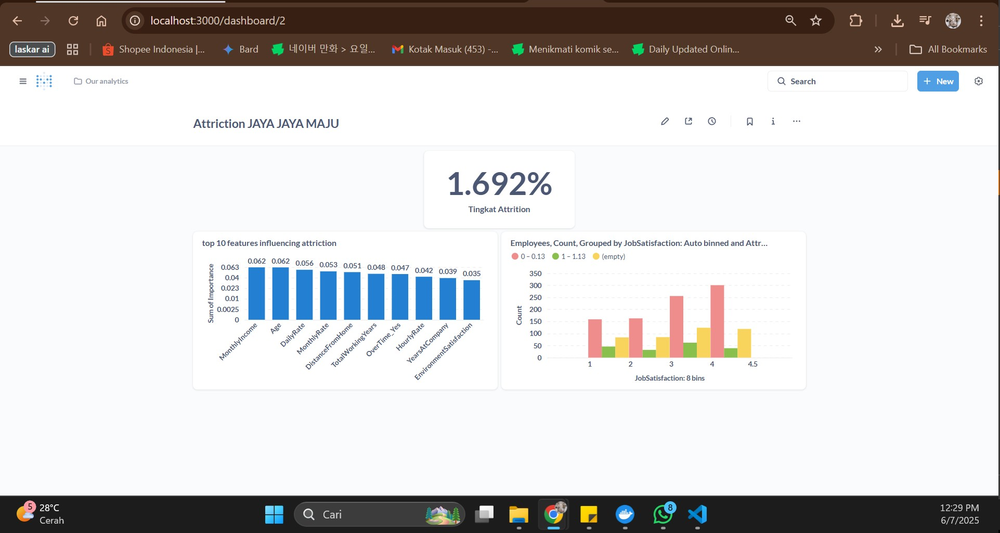

# Proyek Akhir: Menyelesaikan Permasalahan HR JAYAJAYAMAJU

### by Amelia Gizzela

## Business Understanding

Jaya Jaya Maju adalah perusahaan multinasional yang beroperasi sejak tahun 2000 dan kini memiliki lebih dari 1000 karyawan di seluruh Indonesia. Meskipun skala perusahaan sudah besar, Jaya Jaya Maju menghadapi tantangan dalam manajemen sumber daya manusia yang mengakibatkan tingginya tingkat *attrition* (pergantian karyawan).

### Permasalahan Bisnis

Permasalahan utama yang dihadapi oleh departemen HR Jaya Jaya Maju dan akan diselesaikan dalam proyek ini adalah:

1.  **Tingkat *Attrition* Tinggi:** Angka *attrition rate* perusahaan mencapai lebih dari 10%, yang secara spesifik berdasarkan analisis data adalah **16,92%**. Angka ini melebihi ambang batas wajar dan dapat mengganggu stabilitas operasional serta meningkatkan biaya rekrutmen.

2.  **Kurangnya Pemahaman Faktor Pendorong *Attrition*:** Manajemen belum memiliki pemahaman yang mendalam berbasis data mengenai faktor-faktor utama yang menyebabkan karyawan memutuskan untuk keluar dari perusahaan.

3.  **Kebutuhan Alat Monitoring:** Departemen HR memerlukan sebuah alat bantu visual (*dashboard*) untuk dapat memonitor metrik-metrik kunci terkait *attrition* secara efektif dan berkelanjutan.

### Cakupan Proyek

Proyek ini bertujuan untuk mengatasi permasalahan tersebut dengan cakupan sebagai berikut:

1.  **Analisis Data Karyawan:** Menganalisis data historis karyawan untuk mengidentifikasi dan memvalidasi faktor-faktor utama yang paling signifikan mempengaruhi tingkat *attrition*.

2.  **Pembuatan *Business Dashboard*:** Merancang dan membuat *dashboard* interaktif untuk departemen HR yang menyajikan KPI dan visualisasi data terkait faktor-faktor pendorong *attrition*.

3.  **Pemberian Rekomendasi:** Memberikan rekomendasi strategis yang dapat ditindaklanjuti (*actionable*) oleh manajemen berdasarkan temuan dari analisis data.

### Persiapan

**Sumber data:** Datasetnya dari Dicoding di masukkan ke supabase*.

**Akun Metabase** email: root@mail.com, password: root123

**Setup environment:**
Proses analisis data dan pembuatan model dilakukan menggunakan Python dengan beberapa pustaka utama sebagai berikut:

```
import pandas as pd
import numpy as np
import matplotlib.pyplot as plt
import seaborn as sns
import plotly.express as px
from sklearn.model_selection import train_test_split
from sklearn.ensemble import RandomForestClassifier
from sklearn.metrics import classification_report
```

## Business Dashboard

Sebuah *business dashboard* telah dibuat untuk membantu departemen HR Jaya Jaya Maju dalam memonitor tingkat *attrition* secara *real-time* dan memahami faktor-faktor pendorongnya secara visual.



Dashboard ini berfokus pada tiga komponen utama:

1.  **KPI Utama:** Menampilkan tingkat *attrition* saat ini secara jelas.

2.  **Analisis Faktor Utama:** Menyajikan visualisasi 10 faktor paling berpengaruh terhadap *attrition*, seperti pendapatan bulanan, usia, dan tarif harian. Ini membantu manajemen untuk fokus pada area perbaikan yang paling berdampak.

3.  **Visualisasi Hubungan Faktor:** Grafik interaktif yang menunjukkan korelasi antara variabel kunci (contoh: Kepuasan Kerja) dengan status *attrition* karyawan, memberikan pemahaman yang lebih mendalam mengenai tren yang terjadi.

## Conclusion

Berdasarkan analisis yang telah dilakukan, dapat disimpulkan bahwa tingkat *attrition* di Jaya Jaya Maju sebesar **16,92%** didorong oleh beberapa faktor utama. Faktor-faktor finansial seperti **Pendapatan Bulanan** dan **Tarif Harian**, faktor demografis seperti **Usia**, serta faktor terkait pekerjaan seperti **Lembur**, **Kepuasan Lingkungan**, dan **Kepuasan Kerja** merupakan prediktor terkuat dari keputusan seorang karyawan untuk meninggalkan perusahaan. *Dashboard* yang telah dibuat berhasil menyajikan temuan-temuan ini secara visual dan dapat menjadi alat bantu strategis bagi tim HR untuk monitoring berkelanjutan.

### Rekomendasi Action Items

Berikut adalah beberapa rekomendasi dan *action items* yang dapat dilakukan oleh perusahaan untuk menekan tingkat *attrition*:

* **Meninjau Ulang Struktur Kompensasi:** Lakukan analisis kesenjangan gaji dan tinjau ulang struktur pendapatan, terutama untuk karyawan dengan *Monthly Income* di bawah rata-rata perusahaan yang terbukti menjadi faktor *attrition* tertinggi.
* **Mengembangkan Program Peningkatan Keterlibatan Karyawan:** Buat program yang berfokus pada peningkatan kepuasan kerja dan kepuasan lingkungan, seperti sesi umpan balik rutin, program apresiasi, dan perbaikan lingkungan kerja.
* **Mengelola Beban Kerja dan Lembur:** Tinjau kebijakan lembur (*OverTime*) dan distribusikan beban kerja secara lebih merata untuk meningkatkan *work-life balance*, terutama pada peran-peran dengan tingkat lembur yang tinggi.
* **Menerapkan Strategi Retensi Berdasarkan Usia:** Kembangkan program retensi yang berbeda dan disesuaikan untuk kelompok usia yang lebih muda, yang cenderung memiliki tingkat *attrition* lebih tinggi, misalnya dengan menawarkan jalur karier yang jelas dan peluang pengembangan diri.
* **Implementasi Survei dan Analisis Prediktif:** Lakukan survei *exit interview* secara terstruktur untuk validasi temuan dan manfaatkan data yang ada untuk membangun model prediktif guna mengidentifikasi karyawan yang berisiko tinggi untuk *attrition* di masa depan.
